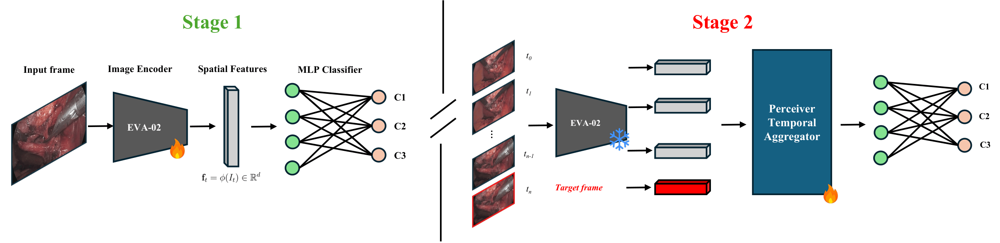
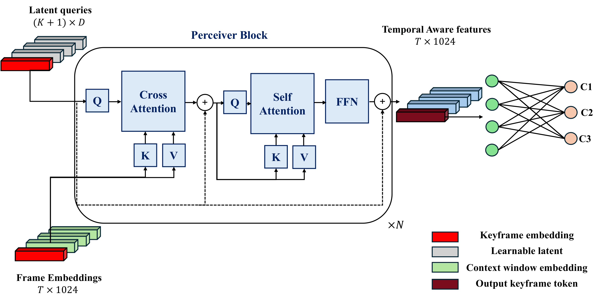

<div align="center">

# Annotation-Efficient Critical View of Safety Assessment with Vision Foundation Models

**Sergio Andrés Cañar Lozano · Javier Santiago Vera Rincón · Isabel Sofía Tovar Sánchez · Pablo Arbeláez**

Universidad de los Andes, Bogotá, Colombia
`{s.canar, j.verar, i.tovars, pa.arbelaez}@uniandes.edu.co`

[](https://github.com/BCV-Uniandes/PercEVA-CVS)
[](https://sergiocanar.github.io/perceva-cvs-page/)

Official implementation of **Annotation-Efficient Critical View of Safety Assessment with Vision Foundation Models**, accepted as an **oral presentation** at the
MICCAI 2026 SafeSurg Workshop.



</div>

---

## Overview

**PercEVA-CVS** is a two-stage pipeline for Critical View of Safety (CVS) assessment on
laparoscopic cholecystectomy video, predicting the three CVS criteria (C1, C2, C3) **without
any anatomy masks, bounding boxes, or text prompts**. An EVA-02 image encoder feeds a gated
temporal Perceiver, and a general-domain foundation model alone is enough to match or surpass
prior supervised methods.

The two stages are independently runnable, connected by a feature-extraction step:

- **Stage 1** fine-tunes the EVA-02 encoder frame-by-frame.
- **Stage 2** freezes it and trains a gated temporal Perceiver that cross-attends into a
  window of cached frame embeddings to produce the final, temporally-aware prediction.
- An **end-to-end (E2E)** variant trains both jointly on raw frames instead.

This repository covers both benchmarks used in the paper, **SAGES 2024** and
**Endoscapes 2023**, for both stages, plus the E2E variant.

<div align="center">
  
</div>

---

## Results

State-of-the-art comparison against prior CVS methods. **Bold** = best, <u>underlined</u> =
second best; `p` is the p-value of a paired significance test against **PercEVA-CVS** (mAP).
`Sup.` is the extra supervision a method needs beyond frame-level CVS labels (`text` prompts,
`box`/`segm` annotations, or `-` for none); `‡` marks methods evaluated with ground-truth
boxes/masks — see the paper for full details and citations.

<details open>
<summary><b>Endoscapes 2023</b></summary>

| Method | Sup. | Params (M) | C1 | C2 | C3 | mAP | p |
|---|---|---|---|---|---|---|---|
| CVS-AdaptNet | text | 133.4 | 52.9±2.5 | 50.0±1.0 | 56.8±1.0 | 53.2±1.5 | 0.005 |
| LG-CVS‡ | box | 112.1 | 67.2±0.6 | 56.8±1.8 | 70.2±2.0 | 64.7±1.2 | 0.039 |
| LG-CVS‡ | segm | 114.8 | 66.9±2.2 | 53.6±2.1 | 67.7±2.2 | 62.8±1.8 | 0.043 |
| SV2LSTG‡ | box | 277.5 | 69.5±1.6 | 58.6±1.9 | 69.4±1.2 | 65.8±1.5 | 0.071 |
| SV2LSTG‡ | segm | 280.1 | 67.3±0.8 | 55.1±3.2 | 67.3±1.3 | 63.3±1.2 | 0.025 |
| SwinCVS Frozen | - | 88.73 | 66.6±1.0 | <u>64.5±0.8</u> | 65.5±1.8 | 65.5±1.0 | 0.035 |
| SwinCVS E2E | - | 88.73 | 63.8±1.6 | 61.1±0.4 | 65.8±2.1 | 63.6±1.3 | 0.028 |
| **EVA-02 L (frame)** | - | 304.1 | <u>72.5±1.3</u> | 59.9±0.6 | 70.7±1.3 | 67.7±0.3 | 0.019 |
| **PercEVA-CVS** | - | 331.6 | **74.8±0.5** | 61.0±0.2 | <u>72.5±0.3</u> | <u>69.4±0.2</u> | — |
| **PercEVA-CVS E2E** | - | 331.6 | 71.0±2.8 | **65.6±4.1** | **74.8±3.5** | **70.5±3.1** | |

</details>

<details open>
<summary><b>SAGES 2024</b></summary>

| Method | Sup. | Params (M) | C1 | C2 | C3 | mAP | p |
|---|---|---|---|---|---|---|---|
| CVS-AdaptNet | text | 133.4 | 35.2±1.3 | 59.1±1.1 | 29.6±0.2 | 41.3±0.7 | 0.003 |
| LG-CVS‡ | box | 112.1 | 47.3±0.6 | 73.7±0.4 | 51.9±0.8 | 57.6±0.4 | 0.008 |
| LG-CVS‡ | segm | 114.8 | 47.1±0.3 | 72.7±0.3 | 50.3±1.5 | 56.7±0.6 | 0.024 |
| SV2LSTG‡ | box | 277.5 | 48.3±2.4 | 73.7±1.2 | 56.1±1.2 | 59.4±1.2 | 0.008 |
| SV2LSTG‡ | segm | 280.1 | 46.9±1.9 | 72.4±0.5 | 50.1±2.7 | 56.5±0.6 | 0.023 |
| SwinCVS Frozen | - | 88.7 | 40.1±0.2 | 70.0±0.3 | 44.7±2.2 | 51.6±0.8 | 0.001 |
| SwinCVS E2E | - | 88.7 | 38.4±1.1 | 64.8±2.1 | 38.9±2.6 | 47.4±1.5 | 0.012 |
| **EVA-02 L (frame)** | - | 304.1 | 53.0±1.5 | 80.6±0.9 | 56.4±1.4 | 63.3±1.1 | 0.091 |
| **PercEVA-CVS** | - | 331.6 | **54.1±1.1** | <u>80.9±1.0</u> | **60.4±2.1** | **65.1±1.3** | — |
| **PercEVA-CVS E2E** | - | 331.6 | <u>53.8±1.1</u> | **81.0±0.9** | <u>59.4±0.9</u> | <u>64.7±0.9</u> | |

</details>

---

## Contents

- [Results](#results)
- [Installation](#installation)
- [Data](#data)
- [Feature Extraction](#feature-extraction)
- [Training](#training)
- [Pre-trained Weights](#pre-trained-weights)
- [Inference](#inference)
- [Acknowledgments](#acknowledgments)
- [Citation](#citation)
- [License](#license)

---

## Installation

```bash
conda create -n cvs python=3.12.12 && conda activate cvs
pip install --index-url https://download.pytorch.org/whl/cu130 \
    torch==2.10.0+cu130 torchvision==0.25.0+cu130
pip install -r requirements.txt
```

On shared multi-GPU machines, **always pin a GPU** before running anything here. Every
script uses the Hugging Face `Trainer`, which otherwise wraps the model across *all* visible
GPUs:

```bash
CUDA_VISIBLE_DEVICES=0 python ...
```

---

## Data

This repo doesn't ship the datasets — download each and point `data/` at them, or pass
`--data_path` directly to any script.

### SAGES 2024

Available on the Hugging Face Hub under
[`CAMMA-public/SAGES_CVS_Challenge_2024`](https://huggingface.co/datasets/CAMMA-public/SAGES_CVS_Challenge_2024)
(CC BY-NC 4.0):

```bash
huggingface-cli download CAMMA-public/SAGES_CVS_Challenge_2024 \
    --repo-type dataset --local-dir data/SAGES_2024
```

The download gives you **videos + label CSVs, not extracted frames**, and only ships `train`/
`test` — `val` is a fixed 200-video subset of `train` used for this paper, without a public
split file of its own. Two steps to reach the expected layout:

**1. Extract frames** — the download includes the dataset's own `tools/preprocess_videos.py`
(run from `data/SAGES_2024/`; it names frame folders after each video's raw UUID):

```bash
cd data/SAGES_2024
python tools/preprocess_videos.py --dataset-root . --split train --fps 1.0 --frames-directory train/frames
python tools/preprocess_videos.py --dataset-root . --split test  --fps 1.0 --frames-directory test/frames
cd ../..
```

**2. Organize into the final layout** — carve the paper's 200-video val split out of `train/`,
and rename every video (`train`/`val`/`test`) from its UUID to the `video_XXXX` scheme used
throughout this repo and the paper, using the fixed mapping shipped as `data/sages_splits.json`:

```bash
python data/organize_sages_splits.py
```

<details>
<summary><b>Expected layout after both steps</b></summary>

```
data/SAGES_2024/
├── train/
│   ├── frames/video_0001/frame_0000.jpg, ...
│   ├── labels/video_0001/frame.csv, video.csv
│   └── features/            # populated by feature_extractor/extract_ft.py
├── val/                     # same layout, video_0501-video_0700
└── test/                    # same layout, video_0701-video_1000
```

</details>

### Endoscapes-CVS201

Available from [`CAMMA-public/Endoscapes`](https://github.com/CAMMA-public/Endoscapes)
(CC BY-NC-SA 4.0):

```bash
mkdir -p data/endoscapes_2023 && cd data/endoscapes_2023
wget https://s3.unistra.fr/camma_public/datasets/endoscapes/endoscapes.zip
unzip endoscapes.zip -d endoscapes
```

Ships **pre-extracted** (no frame-extraction step needed).

<details>
<summary><b>Expected layout</b></summary>

```
data/endoscapes_2023/
├── endoscapes/
│   ├── train/1_29375.jpg, ..., annotation_ds_coco.json
│   ├── val/                 # same layout
│   └── test/                # same layout
└── endoscapes_features/     # populated by feature_extractor/extract_ft.py
    ├── train/features/{video_id}/frame_....pth
    ├── val/...
    └── test/...
```

</details>

---

## Feature Extraction

Both stages need per-frame features cached first:

```bash
# SAGES
python feature_extractor/extract_ft.py \
    --weights_path weights/best_eva02_enc_cvs.pt --splits train val test

# Endoscapes
python feature_extractor/extract_ft.py --dataset endoscapes \
    --weights_path weights/eva02_enc_endoscapes/model.safetensors \
    --data_path data/endoscapes_2023/endoscapes \
    --output_root data/endoscapes_2023/endoscapes_features \
    --splits train val test
```


---

## Training

`--dataset {sages,endoscapes}` selects the dataset/recipe for every entrypoint below.

```bash
# Stage 1 — image encoder
python main_scripts/main_image_encoder.py --dataset sages      --config configs/eva02.yaml
python main_scripts/main_image_encoder.py --dataset endoscapes --config configs/eva02_endoscapes.yaml

# Stage 2 — temporal perceiver (needs Stage 1 features extracted first)
python main_scripts/main_temporal_perceiver_concat_gate.py --dataset sages      --config configs/perceiver_sages.yaml
python main_scripts/main_temporal_perceiver_concat_gate.py --dataset endoscapes --config configs/perceiver_endoscapes.yaml

# End-to-end — encoder + perceiver trained jointly on raw frames
python main_scripts/main_e2e.py --dataset sages      --config configs/end2end_sages.yaml
python main_scripts/main_e2e.py --dataset endoscapes --config configs/end2end_endoscapes.yaml
```

`run_scripts/*.sh` wrap each of these with the exact hyperparameters used for this repo's
packaged checkpoints — run as `bash run_scripts/<name>.sh`. All write outputs under
`outputs/`, logging locally only (`training.log` + metrics JSON).

The paper's mean ± std results are averaged over three seeds: **42, 1, 2**. Pass `--seed` to
override any config's default and reproduce a specific one.

---

## Pre-trained Weights

Pre-trained checkpoints matching the paper's reported numbers **will be released soon.**

---

## Inference

```bash
# Stage 1 — image encoder (optional sanity check)
python inference_image_encoder.py \
    --config configs/eva02.yaml --model_path weights/best_eva02_enc_cvs.pt \
    --split_path data/SAGES_2024/test

# Stage 2 — temporal perceiver (the method's final output)
python inference_temporal.py \
    --model_path weights/best_perceiver --split_path data/SAGES_2024/test

python inference_temporal.py \
    --model_path weights/perceiver_endoscapes \
    --split_path data/endoscapes_2023/endoscapes_features/test --dataset endoscapes
```

Writes predictions + metrics under `<model_path>/infer__<split>/`
(`preds/{split}_predictions.json`, `{split}_fast_metrics.json`, `{split}_full_metrics.json`,
`run_info.json`).

There's no separate E2E inference script — E2E training already runs val/test prediction and
metrics at the end.

---

## Acknowledgments

`metrics.py` is adapted, effectively unmodified, from
[SwinCVS](https://github.com/franeknowak/SwinCVS) (Nowak et al., *SwinCVS: a unified approach
to classifying critical view of safety structures in laparoscopic cholecystectomy*, IJCARS
2025), licensed
[CC BY-NC-SA 4.0](https://creativecommons.org/licenses/by-nc-sa/4.0/).

---

## Citation

If you find this work useful, please consider citing:

```bibtex
@inproceedings{canar2026perceva,
  title     = {Annotation-Efficient Critical View of Safety Assessment with Vision Foundation Models},
  author    = {Ca{\~n}ar Lozano, Sergio Andr{\'e}s and Vera Rinc{\'o}n, Javier Santiago and Tovar S{\'a}nchez, Isabel Sof{\'i}a and Arbel{\'a}ez, Pablo},
  booktitle = {Medical Image Computing and Computer Assisted Intervention -- MICCAI 2026 Satellite Events (SafeSurg Workshop)},
  year      = {2026},
  publisher = {Springer}
}
```

---

## License

This work is licensed under [CC BY-NC-SA 4.0](LICENSE.md).

---

<div align="center">
<sub>Developed at Biomedical Computer Vision (BCV), Universidad de los Andes.</sub>
</div>